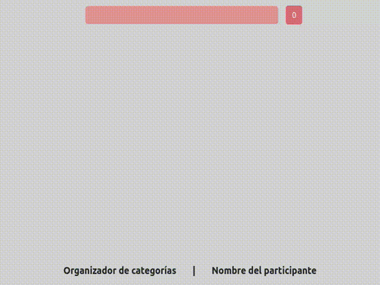

### PRUEBA TÉCNICA

Arrancar servidor de pruebas :

``` npm run dev ``` y [http://localhost:3000](http://localhost:3000)

En esta prueba técnica deberás realizar un SAP, el cual tiene un formulario con un solo input text, y un organizador de términos :

EL INPUT TEXT solo admitira carácteres alfanuméricos, comas y espacios. Cuando con ENTER hagas submit, este deberá tomar todos los términos entre comas (y si no, el que quede solo) y:

- borrar los espacios al comienzo y final de cada término
- permitir los términos mayores de 3 carácteres y menos de 25
- Poner la primera letra en mayúscula y el resto en minúscula
- si se encuentra en la lista, no añadirlo de nuevo.
- Solo se podrá hacer submit ( + vaciarse el input ) si el contenido del input puede producir cambios en la lista de términos. Cambia el fondo del input entre verde y rojo para indicar su validez.

- A la derecha del input deberá de haber un botón que cuente todos los términos en la lista, y al pulsarlo, vaciarla por completo.

LA LISTA DE TÉRMINOS será un componente que ofrezca todos los términos ordenados alfabeticamente y agrupados por su inicial. Cada grupo comenzará con un botón que indica la inicial, la cantidad de términos con esa inicial y al pulsarlo, borra todos esos términos. El grupo continuará con una secuencia de botones donde cada uno es un término, y al pulsarlo, desaparecerá de la lista.

- Centraliza todas estas funciones en un hook que controle esta lógica.

- No tengas reparos en usar 'use client' al comienzo de todo componente, ya que la lógica del SAP es demasiado pequeña como para hacerla SSR.
- Si no sabes hacer testing, adelante igualmente. Toma esta misma prueba en el futuro tras aprender testing y saca tus propias conclusiones.
- La única prueba que se fracasa es aquella en la que no se aprende. Confía en todo el transcurso de la prueba, pero mas aún en tus capacidades.

Firme su prueba técnica añadiendo su nombre donde se indica en el layout :
```src/app/layout.tsx```

Resultado :
<br>



### Escriba aquí debajo cuanto necesite :
